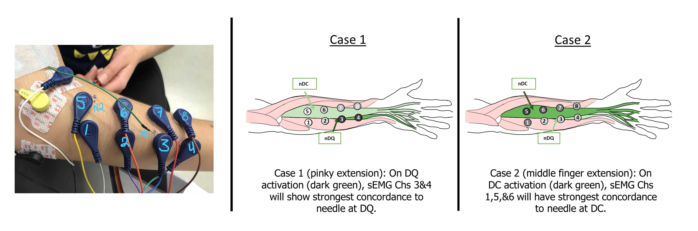
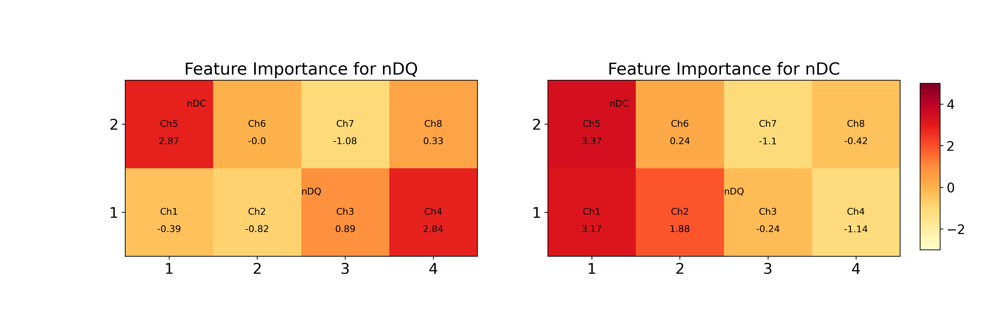

# Forearm Pulse Analysis

### Objective: 
Filter and process the data, transforming it into binary to build a logistic regression model that predicts the activity of the needle at the Digitorum Communis (nDC) from the surface electrodes. Repeat for the needle at the Digiti Quinti (nDQ). 

### Hypothesis: 
* The nDC activity is best predicted by the surface electrodes 1, 5, and 6 due to their proximity to each other and the muscle of interest.
* Similarly, nDQ activity is best predicted by surface channels 3 and 4 due to proximity to the muscle and each other.

### Experiment Summary: 
* Conducted on March 18, 2020. 
* Biopac, 2 Needle Electrodes tested separately due to 1 channel capacity. Sampling frequency 4000 Hz.
* Electrodes were separated center-center 3 cm width, 2 cm height.
* First Insertion site was used with Ex. Digiti Quinti (N1) and with Ex. Digitorum Communis (N2). No complications to report.
* Skin prep was done with alcohol wipes and Nuprep exfoliating gel. Electrode locations were marked with a Surgical Marker.
* Tasks involved sharp isolated finger extensions, slow isolated finger extensions, fast (half-time) isolated finger tapping, and hand extension/flexion contractions.
* Experiment was done by Gladys Ornelas with help from Research Assistants Xiaoyi Ma, Ruby Rios Ramirez, and Hassler Bueno Garcia.

### Rationale Behind Logistic Regression: 

The surface EMG data is a (2,4) grid that can describe the activity of a surface electrode at position $(x,y)$ as:

$$S_{x,y}(t) = \begin{cases}
0 & \text{ off} \\
1 & \text{ on }
\end{cases}$$

We can also assume some randomness is involved which allows us to analyze this data statistically. Therefore we can treat $S_{x,y}(t)$ as a Bernoulli (binary) random variable.

For now, we define $Y(t)$ as $S_{x,y}(t)$ for some position $(x,y)$. For instance, it could be the $(x,y)$ position associated with surface channel 1.

A Bernoulli random variable $Y$ has a pmf given by

$$\begin{eqnarray}
P_Y(k) &\triangleq& \mathbb{P}(Y=k) = p^k(1-p)^{1-k}, \qquad k=0,1 \\
         &=&  \begin{cases}
 p & k=1\\
 1-p & k=0
 \end{cases}
\end{eqnarray}$$

##### We know that the surface activity of any electrode should depend on the activity of the underlying nerve and muscle pair.  In this case, we are assuming each needle electrode is recording this underlying muscle and nerve activity. 

Fundamentally, the surface EMG recordings we collect are assumed to be a superposition of the voltages from many nerves and muscles that are near that electrode. Some of those may be active at time $t$ and others may not be.

Notice that $Y$ varies over time, therefore the underlying distribution (e.g. $p$) for $Y$ must vary over time as well.

$$\begin{eqnarray}
P_{Y_t}(k) &\triangleq& \mathbb{P}(Y_t=k) = p_t^k(1-p_t)^{1-k}, \qquad k=0,1 \\
         &=&  \begin{cases}
 p_t & k=1\\
 1-p_t & k=0
 \end{cases}
\end{eqnarray}$$

We are defining needle 1 at time $t$ as $N_1(t)$ and likewise for needle 2: $N_2(t)$

Then we assume that $p_t$ is a function of $N_1(t)$, $N_2(t)$, as well as the spatial position $(x,y)$.

We define $g(p) = \log \frac{p}{1-p}$ and we declare: 

$$\begin{eqnarray}
g(p_t) &=& x_0 + x_1 N_1(t) + x_2 N_2(t)
\end{eqnarray}$$

Where both $g(p_t)$ and $x_0 + x_1 N_1(t) + x_2 N_2(t)$ are any real number. After some derivation (will be added when time permits), we come to this logistic regression model representation of the data: 

$$\begin{eqnarray}
p(t) &=& \frac{\exp\left(x_0 + x_1 N_1(t) + x_2 N_2(t) \right)}{1+\exp\left(x_0 + x_1 N_1(t) + x_2 N_2(t) \right)}
\end{eqnarray}$$

### Results: 

The results partially support the original hypothesis for both needle electrodes. In regards to the needle at the Digitorum Communis (nDC), it was originally hypothesized that Chs 1, 5, and 6 would be the best predictors. The results show 1, 5, and 2. For the Digiti Quinti muscle (nDQ), it was originally hypothesized that Chs 3 and 4 would be the best predictors. Results show that it was 4, 5, and then 3. 

